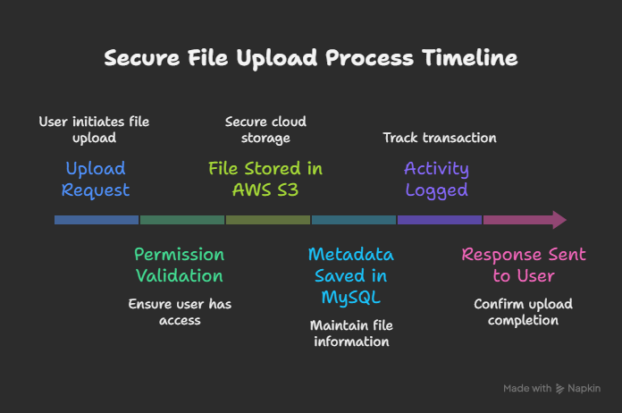

# CloudVault – Secure Cloud Document Sharing Platform

---

## 1. Project Overview

CloudVault is a secure cloud-based document sharing platform that enables users to upload, manage, and share files with fine-grained access control.

The system focuses on:
- Secure cloud storage
- Permission-based access
- Complete activity tracking

Users can control who can view, download, or modify documents while maintaining a full audit trail.

---

## 2. Problem Statement

Traditional file sharing systems often suffer from:

- Weak access control
- No visibility of file usage
- Poor scalability
- Security vulnerabilities

CloudVault solves this by:

- Using cloud storage for durability and scale
- Enforcing role-based permissions
- Logging all user actions
- Securing access via authentication tokens

---

## 3. Tech Stack

| Component | Technology | Reason |
|----------|-----------|-------|
| Frontend | React.js | Fast and scalable UI |
| Backend | Spring Boot | Secure REST services |
| Database | MySQL | Structured metadata |
| Storage | AWS S3 | Reliable object storage |
| Security | JWT + Spring Security | Token-based auth |
| Logging | Spring AOP + MySQL | Activity auditing |

---

## 4. System Architecture

### Overall Flow

1. Frontend (React)
   - File upload/download
   - Permission management
   - Activity monitoring

2. Backend (Spring Boot)
   - Authentication & authorization
   - File processing
   - Access validation

3. Storage Layer
   - Files stored in AWS S3
   - Metadata stored in MySQL

4. Security Layer
   - JWT token validation
   - Permission enforcement

---

### Internal File Handling Flow

Upload Request  
→ Permission Validation  
→ File Stored in AWS S3  
→ Metadata Saved in MySQL  
→ Activity Logged  
→ Response Sent  

---

## 5. Functional Requirements

### 5.1 User Management

- User registration & login  
- JWT authentication  
- Role-based authorization  

---

### 5.2 File Upload Manager

- Upload documents  
- Rename files  
- Delete files  
- Versioning (optional)

---

### 5.3 Access Control System

- Public/private files  
- Share with specific users  
- Permission levels:
  - View  
  - Download  
  - Edit  

---

### 5.4 Activity Logs

- Upload history  
- Download history  
- Access modifications  
- Deletion records  

---

### 5.5 Secure Downloads

- Token verification  
- Time-limited access links  
- Unauthorized access prevention  

---

## 6. Non-Functional Requirements

- High security  
- Fast performance  
- Scalable architecture  
- Fault tolerance  
- Audit compliance  
- Clean UI  

---

## 7. Development Plan – 8 Module Breakdown

---

### Module 1 – Project Setup & Infrastructure

**Goal:**  
Initialize core system components.

**What Happens:**
- Frontend & backend setup
- Database configuration
- AWS S3 integration

**Output:**
- Running services
- Test file upload

---

### Module 2 – Authentication System

**Goal:**  
Secure the platform.

**What Happens:**
- JWT implementation
- API security
- Role handling

**Output:**
- Login/register functionality
- Protected APIs

---

### Module 3 – File Upload Manager

**Goal:**  
Enable document uploads.

**What Happens:**
- Multipart upload handling
- S3 storage
- Metadata saving

**Output:**
- File upload interface

---

### Module 4 – Access Control Engine

**Goal:**  
Permission-based sharing.

**What Happens:**
- Sharing logic
- Permission validation

**Output:**
- Secure document sharing

---

### Module 5 – Secure Download System

**Goal:**  
Controlled access to files.

**What Happens:**
- Token validation
- Signed URL generation

**Output:**
- Protected downloads

---

### Module 6 – Activity Logging System

**Goal:**  
Full audit trail.

**What Happens:**
- Log uploads
- Log downloads
- Log permission changes

**Output:**
- Activity monitoring dashboard

---

### Module 7 – Metadata Management

**Goal:**  
Organized document info.

**What Happens:**
- Store file attributes
- Optimize queries

**Output:**
- Efficient document listing

---

### Module 8 – Optimization & Security Hardening

**Goal:**  
Production readiness.

**What Happens:**
- Input validation
- Rate limiting
- Performance tuning

**Output:**
- Secure scalable platform

---

## Conclusion

CloudVault delivers a secure, scalable document sharing solution with fine-grained access control and complete audit visibility, suitable for enterprise-level use cases.
